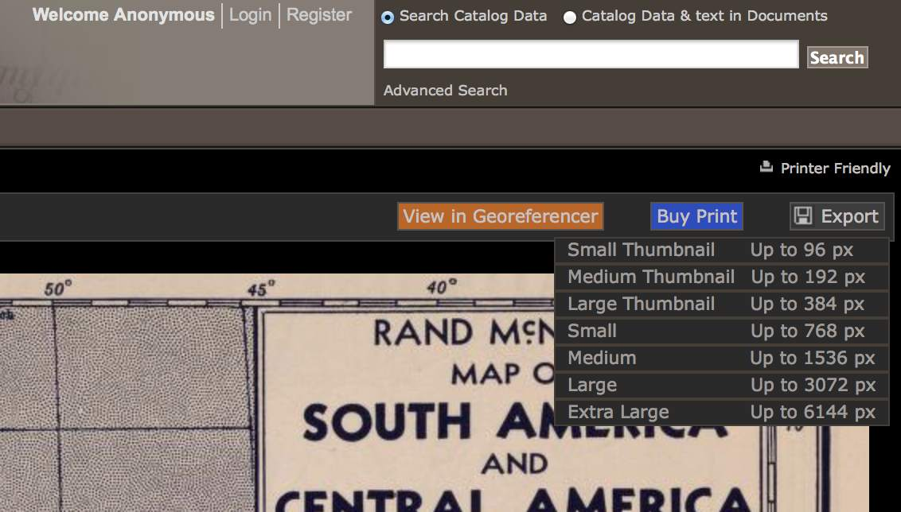

Start by downloading a high-res copy of the
[Rand McNally 1940 map](http://rumsey.georeferencer.com/map/KBMKREinftMNFVlcobKoSC/201507272126-7g9Mkm/).
Follow the image link [to the detail view](http://www.davidrumsey.com/luna/servlet/view/search?q=List_No=5969.08&showFirstDetail=1):

Vector Data and QGIS
--------------------

This downloads a file called [5969008.jpg](5969008.jpg).

Download [vector data from Natural Earth](http://www.naturalearthdata.com/downloads/),
selecting a few layers that match the content of the 1940 map:

* [1:50m populated places](http://www.naturalearthdata.com/http//www.naturalearthdata.com/download/50m/cultural/ne_50m_populated_places.zip)
* [1:50m country borders](http://www.naturalearthdata.com/http//www.naturalearthdata.com/download/50m/cultural/ne_50m_admin_0_countries.zip)
* [1:50m 5° graticules](http://www.naturalearthdata.com/http//www.naturalearthdata.com/download/50m/physical/ne_50m_graticules_5.zip)

The projection of the 1940 map looks a bit like [Mollweide](https://en.wikipedia.org/wiki/Mollweide_projection)
centered on 59°W, so we start by reprojecting the vector data into the
[right PROJ.4 projection string](http://www.remotesensing.org/geotiff/proj_list/mollweide.html):

    ogr2ogr -t_srs '+proj=moll +lon_0=-59' ne_50m_admin_0_countries-moll.shp ne_50m_admin_0_countries.shp
    ogr2ogr -t_srs '+proj=moll +lon_0=-59' ne_50m_populated_places-moll.shp ne_50m_populated_places.shp
    ogr2ogr -t_srs '+proj=moll +lon_0=-59' ne_50m_graticules_5-moll.shp ne_50m_graticules_5.shp

In [QGIS](http://www.qgis.org/), the location can be read from the coordinates display:

